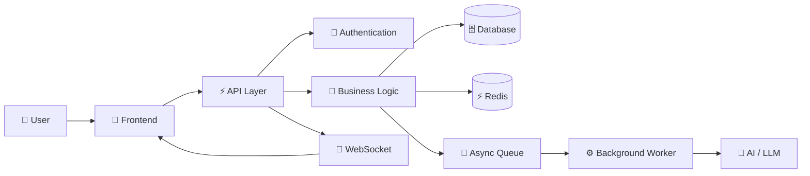

<div align="center">


<br>


<br><br>

<a href="https://shammichalasx.netlify.app">

</a>
<a href="https://linkedin.com/in/shammichalas">

</a>
<a href="https://github.com/shammichalas">

</a>
<a href="mailto:shammichalas0007@gmail.com">

</a>

<br><br>


</div>

---

## 👋 Hey, I'm Sham

```text
Full-Stack Software Engineer
│
├── Frontend
│   ├── React.js
│   ├── Next.js
│   ├── TypeScript
│   └── Blazor
│
├── Backend
│   ├── FastAPI
│   ├── Spring Boot
│   ├── ASP.NET Core
│   ├── Django
│   └── Node.js
│
├── Data
│   ├── MongoDB
│   ├── PostgreSQL
│   ├── MySQL
│   ├── Redis
│   └── Supabase
│
├── Infrastructure
│   ├── Docker
│   ├── AWS Lambda
│   ├── GitHub Actions
│   └── CI/CD
│
└── AI / Systems
    ├── LLM Applications
    ├── RAG
    ├── MCP
    ├── WebSockets
    └── Distributed Systems
```

I build **production-grade full-stack applications, AI-powered platforms, real-time systems, and scalable backend architectures**.

I enjoy taking an idea from:

**💡 Idea → 🧩 Architecture → 💻 Code → 🧪 Test → 🐳 Deploy → 🚀 Production**

---

# ⚡ What I'm Building

<div align="center">

### `FULL-STACK` × `AI` × `SYSTEM DESIGN` × `UI/UX`

<br>


</div>

---

# 🧩 System Architecture / README



### My development flow

```text
01  PLAN
 ↓
02  ARCHITECTURE
 ↓
03  UI / API DESIGN
 ↓
04  IMPLEMENTATION
 ↓
05  DATABASE + SERVICES
 ↓
06  TESTING
 ↓
07  DOCKER / CI-CD
 ↓
08  DEPLOYMENT
 ↓
09  ITERATE
```

---

# 🛠️ Tech Stack

<div align="center">


<br><br>


</div>

---

## 💻 Languages

`JavaScript` `TypeScript` `Python` `Java` `C` `C#`

## 🎨 Frontend

`React.js` `Next.js` `TypeScript` `Blazor WebAssembly` `HTML` `CSS`

## ⚙️ Backend

`FastAPI` `Node.js` `Express.js` `Flask` `ASP.NET Core` `Spring Boot` `Django`

## 🗄️ Databases

`MongoDB` `PostgreSQL` `MySQL` `Supabase` `Redis` `Firebase`

## ☁️ Cloud & DevOps

`AWS Lambda` `Docker` `Docker Compose` `GitHub Actions` `Jenkins` `CI/CD`

## 🤖 AI / Engineering

`Gemini API` `OpenAI API` `RAG` `MCP` `REST APIs` `JWT` `WebSockets` `CQRS` `OOP`

---

# 🚀 Featured Projects

## 🔥 Flint

### AI Document Intelligence Platform

`Next.js` `FastAPI` `MongoDB` `Firebase Auth` `Gemini API` `MCP` `TypeScript`

```text
PDF
 ↓
Document Processing
 ↓
AI Summarization
 ↓
Embeddings
 ↓
Semantic Search
 ↓
RAG Pipeline
 ↓
Knowledge Retrieval
 ↓
Quizzes / Workspace
```

Built a full-stack AI document platform capable of processing PDFs into:

* 📄 Multi-level summaries
* 🔎 Semantic vector search
* 🧠 Cross-document synthesis
* 📝 Spaced-repetition quizzes
* 🕸️ Interactive SVG force graph
* 🔐 Firebase authentication
* 🔌 MCP server integration

**[🌐 Live Project](https://flintn.netlify.app)**

---

## ☕ CafeSphere

### Real-Time Restaurant Management Platform

`.NET` `Blazor WebAssembly` `MongoDB Atlas` `SignalR` `Redis` `Docker`

```text
Customer
   ↓
POS
   ↓
Order
   ↓
SignalR
   ↓
Kitchen Display
   ↓
Preparing
   ↓
Ready
   ↓
Completed
```

Features:

* 🧾 POS
* 👨‍🍳 Kitchen Display
* 📦 Inventory
* 📅 Reservations
* 🤖 AI sales assistant
* 🔐 JWT authentication
* 👥 Role-based access
* ⚡ Redis caching
* 🔄 SignalR real-time communication
* 🐳 Docker
* 🚀 GitHub Actions CI/CD

**[🌐 Live Project](https://cafespheree.netlify.app)**

---

## 🧑‍💼 HRMS

### Human Resource Management System

`React 19` `TypeScript` `Spring Boot 3` `PostgreSQL` `JWT` `Docker`

```text
React Dashboard
      ↓
TanStack Query
      ↓
REST API
      ↓
Spring Boot
      ↓
CQRS / Services
      ↓
PostgreSQL
```

Includes:

* 👤 Employee lifecycle
* 🕐 Attendance
* 🌴 Leave management
* 💰 Payroll
* 🔐 JWT authentication
* 🛡️ RBAC
* 🗃️ Flyway migrations
* 🔄 MapStruct DTO mapping
* 📊 Recharts dashboards
* 🐳 Docker Compose

**[🌐 Live Project](https://workforhub.netlify.app)**

---

## 📚 Cookbook Studio

### Social Recipe & Digital Cookbook Platform

`Django` `PostgreSQL` `Supabase` `ReportLab`

Features:

* 👨‍🍳 Chef profiles
* 👥 Follow system
* 💬 Nested threaded comments
* 🍲 Recipe recommendations
* 📖 Digital cookbook
* 📄 PDF generation
* 📑 Automatic table of contents
* 🥕 Ingredient checklists
* 🧮 Nutrition panels

**[↗ GitHub Repository](https://github.com/shammichalas/Cookbook-studio)**

---

# 💼 Experience

### Software Engineer Intern

**Skill Software INC — Delaware, USA · Remote**

`Aug 2025 – Sep 2025`

```text
Production Bottleneck
        ↓
Redis Caching
        +
Celery Async Queues
        ↓
~40% p95 Latency Reduction
```

Also worked on LLM-powered automation workflows that reduced manual review time by approximately **70%**.

---

### Full Stack Developer Intern

**Team InfoSoft — Tirunelveli**

`Jun 2024 – Jul 2024`

* Redesigned the company's public-facing website using React.js.
* Delivered the redesign to production.
* Built internal data-analysis dashboards.
* Converted business data into structured operational reports.

---

# 📊 GitHub Analytics

<div align="center">


<br><br>


</div>

---

# 🐍 Contribution Animation

<div align="center">


</div>

---

# 🎯 Engineering Philosophy

<div align="center">

```text
"Don't just make it work.

Make it understandable.
Make it maintainable.
Make it measurable.
Then make it beautiful."
```

</div>

---

# 🎓 Education

### Master of Technology — Information Technology

**Francis Xavier Engineering College, Tirunelveli**

`2026 – 2028`

### Bachelor of Technology — Information Technology

**Francis Xavier Engineering College, Tirunelveli**

`2022 – 2026`

**CGPA: 8.03 / 10**

---

# 🌐 Find Me

<div align="center">

<a href="https://shammichalasx.netlify.app">

</a>

<a href="https://linkedin.com/in/shammichalas">

</a>

<a href="https://github.com/shammichalas">

</a>

<a href="mailto:shammichalas0007@gmail.com">

</a>

<br><br>

### ⚡ Building → Breaking → Learning → Shipping

</div>

---

<div align="center">


</div>
